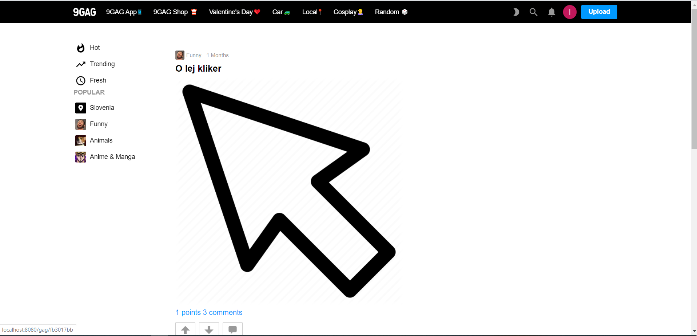
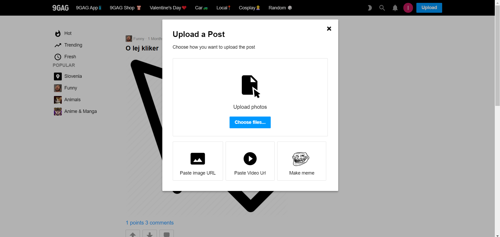
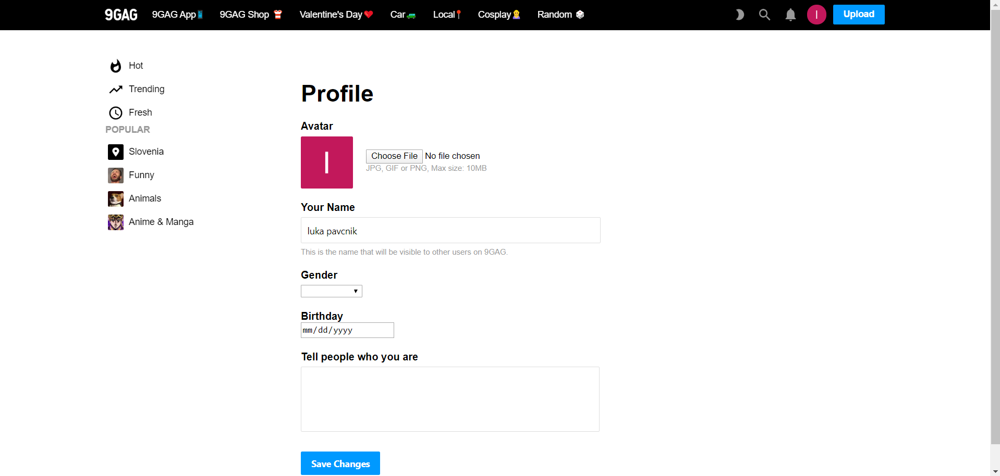
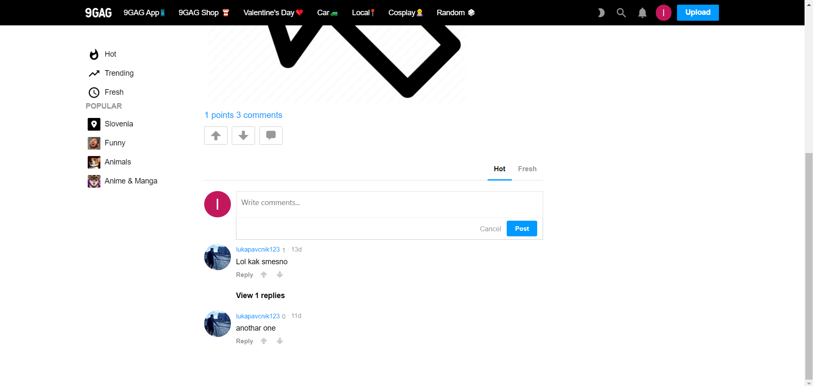
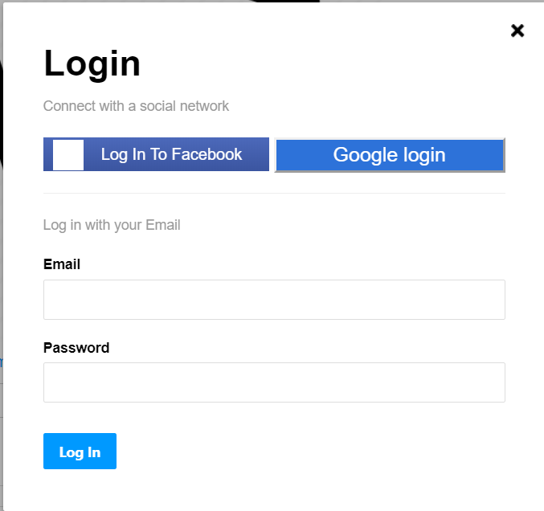
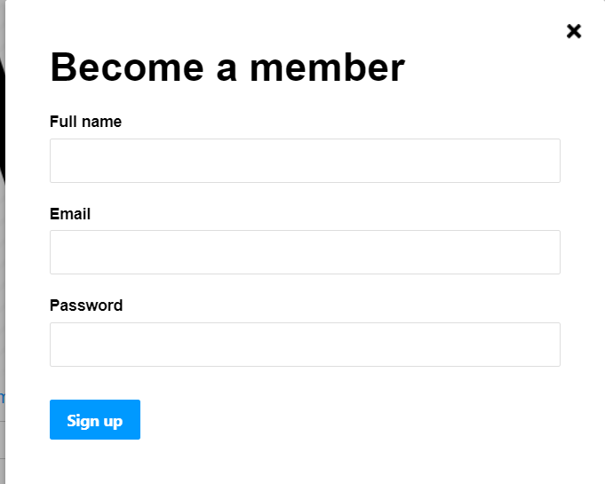
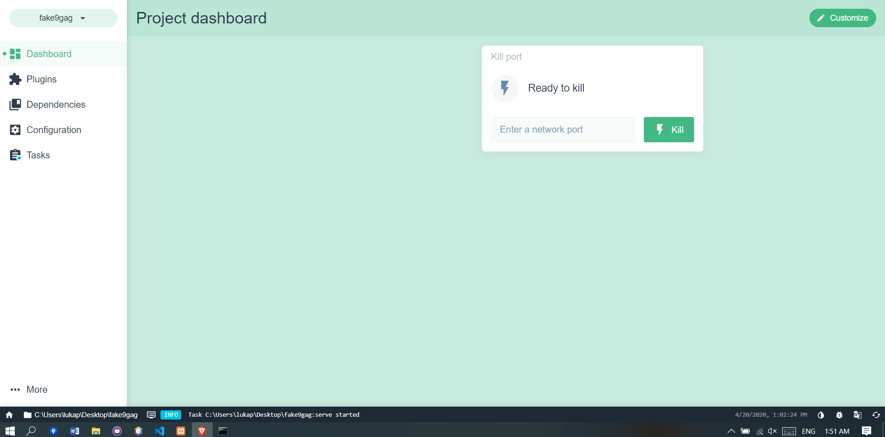
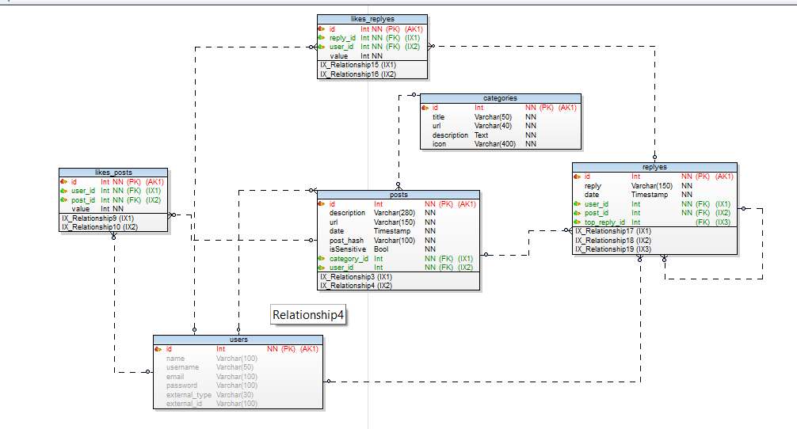

# fake9GAG

  

> This is my personal development of 9gag Website using Vuejs and php backend.

Table Of Contents
* [The Website](#thewebsite)
* [Vue](#vue)
* [Database](#database)
* [Editor](#editor)

## The Website

The website includes many features... such as

 
 > Uploading images

 > Viewing and editing your profile

 > Commenting and liking posts

 > Logging in externaly or registering and making an account

## Vue

Vue is an open-source  JavaScript framework for building user interfaces and single-page applications

I was using vue cli as a standard tooling for vue

### Vue modules that i used
- Vuetify
- Vuex
- VueResource
- VueRouter
- VueSession

## Database
I used Toad Data Modeler for designing my database and later exporting in to sql and using it in phpmyadmin which was hosted on localhost xampp.

## Editor
For all of my coding i used Visual studio which gave me a great environment and workspace.
